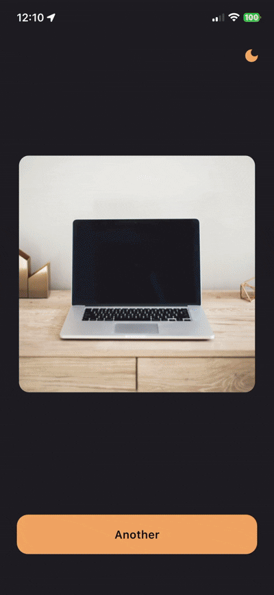
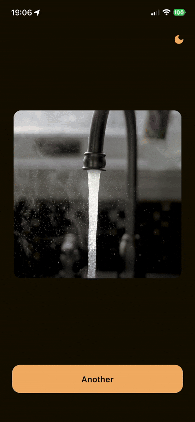

# Tiny Square

A Flutter app that fetches random images and displays them as centered squares with adaptive background colors.

## Demo

<table style="width: 100%;">
  <tr>
    <td>
      <p align="center"><b>App Preview</b></p>
      
    </td>
    <td>
      <p align="center"><b>Error Preview</b></p>
      
    </td>
  </tr>
</table>


## Features

- Fetches random images from API
- Adaptive background colors extracted from images
- Smooth animations (fade transitions, animated background)
- Light/dark theme support with toggle
- Accessibility support (semantic labels, screen reader compatible)

## Architecture

Clean Architecture with 4 layers:

```
lib/
├── presentation/    # UI widgets, pages, helpers
├── application/     # BLoC/Cubits, states, theme management
├── domain/          # Entities, abstract repositories & services
├── infrastructure/  # Implementations, datasources, models
└── core/            # DI, failures, shared utilities
```

### Key Patterns

- **BLoC/Cubit** for state management (flutter_bloc)
- **Dependency Injection** via GetIt
- **Functional error handling** with `dartz` package (`Either<Failure, T>` for results, `Option<T>` for nullable values)
- **SOLID principles** throughout (abstractions injected, single responsibility per class)

### Theming

Colors are extracted from images using `palette_generator_master` to derive dominant and vibrant swatches. UI colors respect the current theme while adapting to image content — button and text colors are based on the theme's primary color but use `Color.lerp` to blend towards image-extracted colors for a more immersive experience.

## Getting Started

```bash
flutter pub get
flutter run
```

## Testing

This project does not currently include automated tests. In a production environment, the following tests should be implemented:

- **Unit tests** for Cubits, repositories, and domain logic
- **Widget tests** for UI components and user interactions
- **Integration tests** for end-to-end user flows

## Screenshots

### Semantics

<div align="center">
  
</div>

### Profiling

Profiling was performed using Flutter DevTools. No jank frames or performance issues were detected.


### Leak Tracking

Used `leak_tracker` to monitor for memory leaks during development. No leaks were detected.

<!-- TODO: Add leak tracking video -->
[Leak Tracking Video Placeholder]